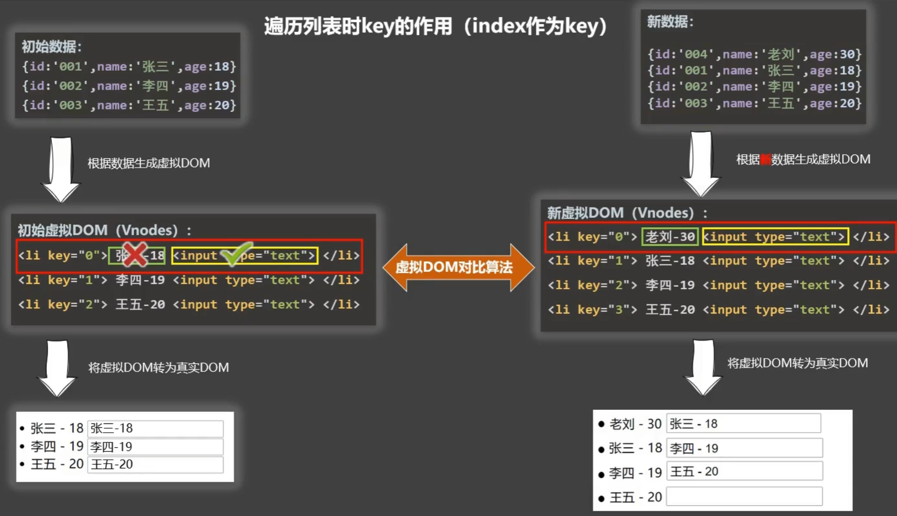
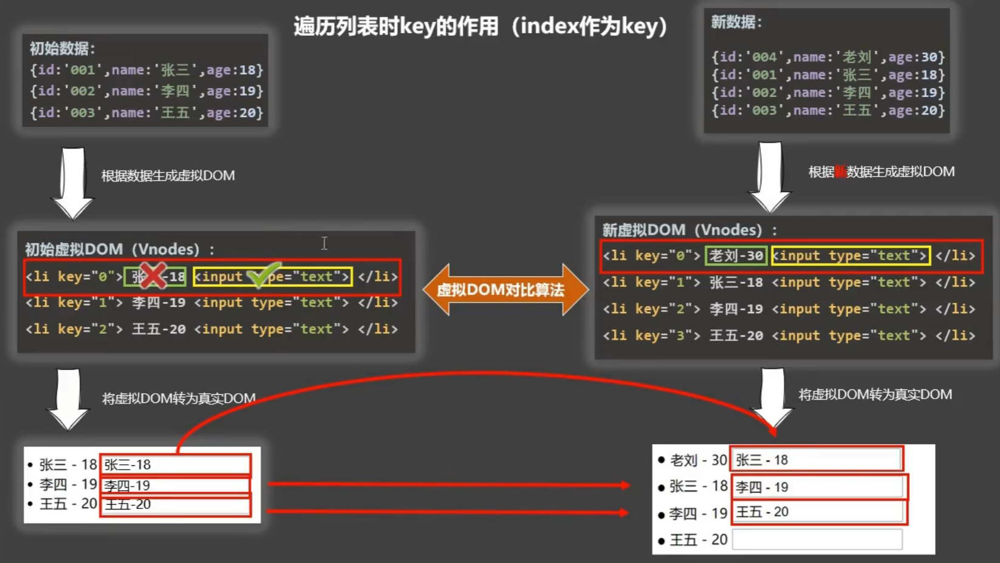
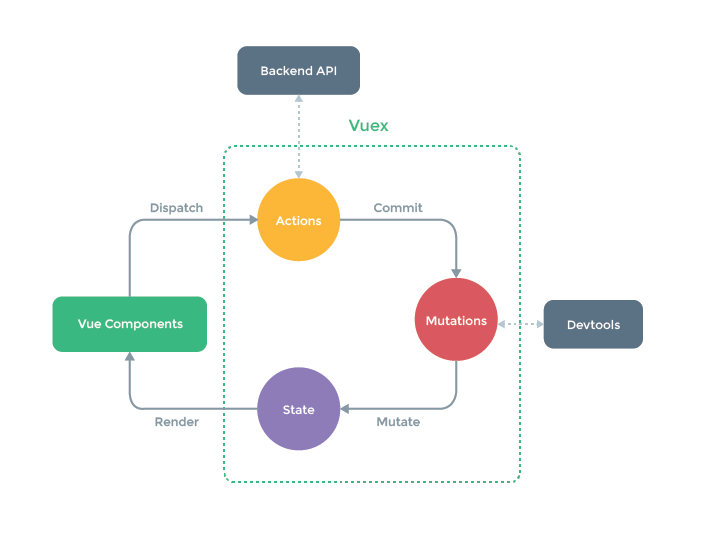

## 数据绑定
### `v-bind`和`v-model`
- 数据代理使用Object.defineProperty()实现。

```javascript
Object.defineProperty(person, 'age', {
    value: 18,
    enumerable: true, //控制属性是否可以枚举，默认值是false
    writable:true, //控制属性是否可以被修改，默认值是false
    configurable:true //控制属性是否可以被删除，默认值是false
})
```

Vue对象中的`_data`使用数据劫持Vue中的`data`

[2_data_proxy.html](../vue2/02-数据代理/2_data_proxy.html)

## 遍历列表时key的作用




## 监视数据变更原理
### 检测对象及属性改变的原理
定义_data(Observer)，代理data中的对象

可以通过`Vue.set`增加数据对象属性，但不能增加data中的根属性。

向响应式对象中增加一个property，并确保新的对象同样是响应式的，且触发视图更新。

### 检测数组改变的原理
- 监测了数组自带的七个方法：push/pop/slice/shift/unshift/sort/reverse.
- `vm.$set(vm._data.array_data, 1, '1')`, `Vue.set(vm.array_data,1,'1')`这种方法也可以修改数组，触发监控

使用包装进行监测。`vm._data.data1.push === Array.prototype.push`这个表达式是false。

## 内置指令
1. `v-text`:更新元素的textContent
2. `v-html`:更新元素的innerHTML
3. `v-if`:如果为true,当前标签才会输出到页面
4. `v-else`:如果为false,当前标签才会输出到页面
5. `v-show`:通过控制display样式来控制显示/隐藏
6. `v-for`:遍历数组/对象
7. `v-on`:绑定事件监听,一般简写为@
8. `v-bind`:绑定解析表达式,可以省略v-bind
9. `v-model`:双向数据绑定
10. `v-cloak`:防止闪现,与css配合:`[v-cloak]{display:none}`

## 生命周期


## 组件
### 组件名称
1、一个单词：
- School 首字母大写
- school 全小写
2、多个单词：
- `my-school` kebab-case命名
- MySchool CamelCase需要Vue脚手架支持

### 组件标签
- `<school></school>`
- `<school/>` 没有脚手架时，会导致后续组件无法渲染

### 简写方式
`const school = Vue.extend(options)`可以简写为`const school = options`

## VueComponent

## 脚手架
- `npm install -g @vue/cli`
- `vue create <proj_name>`

- `vue inspect > out.js`将vue隐藏的配置输出到out.js

### ref
标签的ref属性可以通过`this.$ref.<ref_value>`访问dom元素或组件实例对象（VueComponent）

### props
```json lines
{
  props: [
    'name',
    'age'
  ]
}

{
  props: {
    name: String
  }
}
{
  props: {
    name: {
      type: String,
      default: "123",
      required: true
    }
  }
}
```
- 使用`<School name="name" />` 如果使用`<School :name="name" />`是动态绑定
- props中的数据比data中的数据先加载，所以data中可以使用props中的数据
- props中的数据是只读的，不能修改。如果需要修改，复制到data中修改。

### mixin
用于组件共享配置
```javascript
//mixin.js
export const me = {
    data() {
      return {
          name: 'xx'
      }  
    },
    methods: {
        showName() {
            console.log("name")
        }
    },
    mounted() {
        console.log("mounted")
    }
}

// app.vue
import {me} from 'mixin.js'
export default {
    mixins: [me]
}

//全局混入
//main.js
Vue.mixin(me)
```

mixins中的先加载，但是会覆盖。
- 普通函数覆盖
- 生命周期钩子会同时调用

### 插件
```javascript
// plugins.js
const obj = {
    install(Vue) {
        console.log('@@@install')
        Vue.mixin({
            data() {
                return {
                    name: 'xx'
                }
            },
        })
        Vue.filter('mySlice', function (){})
        Vue.directive('fbind', {})
        // 给Vue原型上增加一个方法
        Vue.prototype.hello = () => {}
    }
}

export default obj


// main.js
import plugins from 'plugins.js'
Vue.use(plugins)
```

## storage
- localStorage存储的内容需要手动清除
- sessionStorage会随着浏览器的关闭清除
- xxxStorage.getItem(xx)如果value找不到会返回null
- Json.parse(null)结果依然是null

## 自定义事件
### 绑定
子组件
```javascript
this.$emit('eventName', p1, p2)
```

父组件
```vue
<ChildComponet @eventName="handleEvent"/>

//或
this.$refs.childCom.$on('eventName', this.handleEvent)
这里的handleEvent也可以是箭头函数，但不能是function，因为this指向不对。
```

### 解绑
子组件中
```javascript
this.$off('eventName')

// 解绑所有的自定义事件
this.$off()

// 销毁组件会解绑所有事件，去除响应式
this.$destroy()
```

组件默认绑定的是自定义事件，`@click`默认绑定的是自定义的`click`。如果想使用原生的click，使用`@click.native`

## 全局事件总线
任意组件间通信
```javascript
new Vue({
render: h => h(App),
beforeCreate() {
    // 注册总线
 Vue.prototype.$bus = this
}
}).$mount('#app')


// 发送消息
this.$bus.$emit("")
// 接受消息
this.$bus.$on('hello', (data)=>{})
// 最好在beforeDestory钩子中，解绑当前组件中用到的事件。
beforeDestory() {
    this.$bus.$off('hello')
}
```

## 消息订阅与发布
`pubsub-js`

## `this.$nextTick`
在下一次DOM更新结束后，执行其指定的回调。

什么时候用：当改变数据后，要基于更新后的新DOM进行某些操作时，要在nextTick的回调函数中执行。

## 过度和动画
动画
```vue
<template>
  <transition name="hello" appear>
    <h1>你好</h1>
  </transition>
</template>
<style>
  // 如果.v-enter-active就是默认所有的transition包裹的元素都执行动画
  .hello-enter-active {
    animation: ani 0.5s linear;
  }

  .hello-leave-active {
    animation: ani 0.5s linear reverse;
  }

  @keyframes ani {
    from {
      transform: translateX(-100%);
    }
    to {
      transform: translateX(0px);
    }
  }
</style>
```

过渡
```vue

<template>
  <!-- transition中只能有一个元素，多个元素使用transition-group并且内部的元素要有key -->
  <transition name="hello" appear>
    <h1>你好</h1>
  </transition>
</template>
<style>
  h1 {
    //transition: 0.5s linear
  }

  /* 进入的起点 */
  .hello-enter, .hello-leave-to {
    transform: translateX(-100%);
  }
  
  .hello-enter-active, .hello-leave-active {
    transition: 0.5s linear;
  }

  /* 进入的终点 */
  .hello-enter-to, .hello-leave {
    transform: translateX(0);
  }
</style>
```


animate.css可以直接用
```vue
<template>
  <transition
      appear
      name="class__asdf"  这里写类名
      enter-active-class="asdfasdf"
      leave-active-class="asdfasdf"
  >
    
  </transition>
</template>
<script>
import 'animate.css'
</script>
```

## proxy
`vue-resource`也可以实现ajax请求（`npm i vue-resource`）
```js
import vueresouce from 'vue-resource'
Vue.use(vueresource)

this.$http.get()
```

### 网络请求方式
- xhr：`new XMLHttpRequest(); xhr.open(); xhr.send()`
- jQuery：主要是dom操作，包含一部分网络请求
- axios：推荐
- fetch：会包装两层promise，兼容性差

### 同源策略
> **同源策略:** 协议名、主机名、端口号必须一致
> 
> 直接的服务器请求不受同源策略的影响（如vue-cli中的devServer、nginx）
>

```js
vue.config.js

module.exports = {
    // 方式一
    // devServer: {
    //     proxy: 'http://localhost:5000' // 会自动创建一个与前台端口一致的代理服务器，代理proxy地址的请求
    // }
    // 方式二
    devServer: {
        proxy: {
            "/api": {
                target: 'http://localhost:5000',
                pathRewrite: {"^/api":""},
                ws: true,
                changeOrigin: true //用于控制请求头中的host字段
            }
        }
    }
}
```

## 示例
样式引入
```js
// 在App.vue中引用
import './assets/css/bootstrap.css'
```

```html
// 在index.html中引入
<link rel="stylesheet" href="<%= BASE_URL %>css/bootstrap.css">
```

> this.info = {...this.info, ...dataObj} 将dataObj中有的元素赋值给info
> 
> 

## vuex
vue中实现集中式状态管理的插件.

集中式管理多个组件的共享状态.

由`store`管理`Actions`/`Mutations`/`State`.
- `store.dispath`
- `store.commit`



使用:
- `npm i vuex@3`
- `Vue.use(Vuex)`
- 创建store文件夹，新建`index.js`文件（或创建vuex文件夹，新建`store.js`文件）
- `new Vue({store})`
- vc ==> store

## vrouter
```vue
<template>
  <!--历史记录相关-->
  <router-link replace></router-link>
  <router-link push></router-link>
  <!--起a标签的作用-->
  <router-link active-class="activeclass" to="/path"></router-link>
  <router-link active-class="activeclass" to="/path/childPath"></router-link>
  <!--query参数-->
  <router-link active-class="activeclass" to="/path/childPath?a=1"></router-link>
  <router-link active-class="activeclass" :to="`/path/childPath?a={m.param1}`"></router-link>
  <!--query的对象写法-->
  <router-link active-class="activeclass" :to="{
      path: '/path/childPath',
      query: {
          id: m.id,
          title: m.title
      }
  }"></router-link>
  <router-link active-class="activeclass" :to="{
      name: 'path1',
      query: {
          id: m.id,
          
          
          title: m.title
      }
  }"></router-link>
  <!--  params只能用name不能用path -->
  <router-link active-class="activeclass" :to="{
      name: 'path1',
      params: {
          id: m.id,
          title: m.title
      }
  }"></router-link>
  <router-view></router-view>
</template>
```

```js
const router = new VueRouter({
    routes: [
        {
            name: 'path1',
            path: '/path1',
            component: Component1,
            children: [
                {
                    path: 'news', // 不能加斜杠！！！
                    component: ChildComponent1
                },
                {
                    path: 'news2/:id/:title', // id,titile是param参数
                    component: ChildComponent1,
                    // 方法1
                    // props: {a:1}
                    // 方法2: 会把组件的所有params参数以props的形式传给这个组件。
                    // props: true
                    // 方法3
                    // props($route) {
                    //     return {id: $route.query.id, title: $route.query.title}
                    // }
                    // 解构赋值
                    props({query:{id,title}}) {
                        return {id: id, title: title}
                    }
                }
            ]
        }
    ]
})
```

```js
页面会有$routes

所有的页面共享$router
```

- `src/pages`放路由组件
- `src/components`放一般组件

> 可以将对象保存在window中方便调式 如`window.a = this.$routes`


### 编程式路由导航
```vue
<script>
    this.$router.push({
      name: '',
      query: {
          id: m.id
      }
    })
  
    this.$router.replace({
      name: '',
      query: {
        id: m.id
      } 
    })
  
  this.$router.back() // 前进
  this.$router.forward() // 后退
  this.$router.go(i) // 往前走i步
</script>
```

### 路由缓存
```vue

<template>
  <!-- 默认缓存所有 -->
  <keep-alive>
    <router-view></router-view>
  </keep-alive>
  <!-- 只缓存给定的组件:组件名称 -->
  <keep-alive include="News">
    <router-view></router-view>
  </keep-alive>
  <keep-alive :include=["News"] >
    <router-view></router-view>
  </keep-alive>
</template>
```

### 新的生命周期钩子
在keep-alive情况下，
```vue
<script>
  methods: {
    activated(){
    },
    deactivated()
    {
    }
  }
</script>
```

### 全局路由守卫
```js
// 全局前置路由守卫
router.beforeEach((to, from, next) => {
    if (to.meta.auth === 'authed') {
        // 放行
        next()
    } else {
        alert("没有权限")
    }
})

router.afterEach((to,from) => {
    document.title = to.meta.title || '其他标题'
})
```

### 独享路由守卫
只有前置没有后置
```js
const router = new VueRouter({
    routes: [
        {
            name: 'path1',
            path: '/path1',
            component: Component1,
            beforeEnter: (to, from, next) => {
                
            }
        }
    ]
})
```


