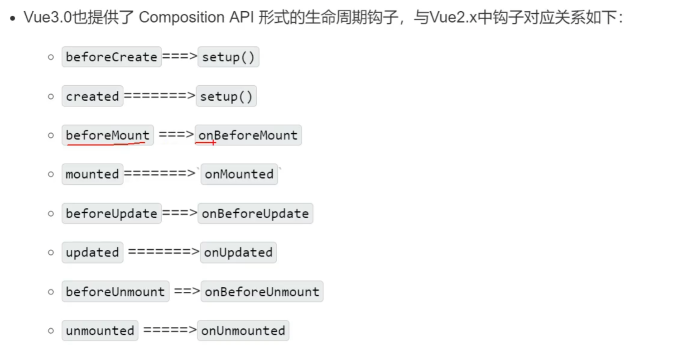

## 安装

- `npm install -g @vue/cli`

### 使用vue-cli

- `vue create <proj_name>`
- `npm run serve`

### 使用vite

> - 新一代前端构建工具
> - 开发环境无需打包，冷启动
> - 轻量快速的热重载
> - 按需编译，不需要等待整个应用编译完成

1. `npm init vite-app <proj_name>`
2. `npm install`
3. `npm run dev`

> 组件可以没有根标签

## Composition API

### setup

1. 组件中用到的数据、方法，均配置在setup中。
2. 两种返回值：
    - 若返回一个对象，对象中的属性、方法在模板中均可以直接使用
    - 若返回一个渲染函数，则可以自定义渲染内容。`()=>{ return h('h1', 'content') }`

### ref函数

```vue

<script>
  import {ref} from 'vue'

  export default {
    name: 'App',
    setup() {
      let age = ref(18) // 引用对象
      let job = ref({
        type: 'engineer',
        salary: '100k'
      })

      function changeInfo() {
        age.value = 28
        job.value.salary = '200k'
      }
    }
  }
</script>
```

### reactive函数

- 定义一个对象类型的响应式数据。（基于Proxy。 基本类型只能使用ref）

```vue

<script>
  import {ref, reactive} from 'vue'

  export default {
    name: 'App',
    setup() {
      let age = ref(18) // 引用对象
      let job = reactive({
        type: 'engineer',
        salary: '100k'
      })

      function changeInfo() {
        age.value = 28
        job.salary = '200k'
      }
    }
  }
</script>
```

### 响应式原理

#### vue2的问题

- 新增、删除属性，页面不会动态刷新（要使用`$set`,`$delete`）
- 直接通过数组下标修改数组，不会刷新（要用slice或`$set(list,0,value)`）

#### vue3中的原理

拦截对象中任意属性的变化。使用Proxy实现对数据的增加、删除的拦截

```js
let person = {name: 'name', age: 'age'}
const p = new Proxy(person, {
    get(target, propName) {
        console.log(`有人读取了p上的${propName}属性`)
        return Reflect.get(target, propName)
        // return target[propName]
    },
    set(target, propName, value) {
        console.log(`有人设置了p上的${propName}属性为${value}`)
        Reflect.set(target, propName, value)
        // target[propName] = value
    },
    deleteProperty(target, propName) {
        Reflect.deleteProperty(target, propName)
        // delete target[propName]
    }
})
```

### setup相关的注意点

- 在beforeCreate之前执行，`this`是undefined
- setup的两个参数
    - props: 外部组件传入的属性
    - context: `context.emit`, `context.attrs`, `context.slots`

### 计算属性

```vue

<script>
  import {computed, reactive} from 'vue'

  export default {
    setup() {
      let person = reactive({
        firstName: '张',
        lastName: '三'
      })
      // 简写，不考虑计算属性被修改
      person.fullName = computed(() => {
        return person.firstName + person.lastName
      })
      // 完整
      person.fullName = computed({
        get() {
          return person.firstName + '-' + person.lastName
        },
        set(value) {
          const nameArr = value.split("-")
          person.firstName = nameArr[0]
          person.lastName = nameArr[1]
        }
      })
    }
  }
</script>
```

### 监视

```vue

<script>
  import {reactive, ref, watch, watchEffect} from 'vue'

  export default {
    setup() {
      let sum = ref(0)
      let msg = ref('你好啊')
      let person = reactive({name: '张', age: 10, job: {info: {salary: 12}}})

      watchEffect(() => {
        // 自动检测里面的函数用到了谁
        // 很像computed但是不需要返回值
        const x1 = sum.value
        const x2 = person.age
      })

      // 监视ref定义的一个数据
      watch(sum, (newValue, oldValue) => {
        console.log('sum变了')
      }, {immediate: true, deep: true}) //初始化时就执行

      // 监视ref定义的多个响应式数据
      watch([sum, msg], (newValues, oldValues) => {
        console.log('sum变了')
      })

      // 监视reactive数据
      // 强制开启了深度监视，deep配置无效
      // 这里的newValue和oldValue都是新值，无法正确获取oldValue
      // 如果实在需要，用ref包了这个属性
      watch(person, (newValue, oldValue) => {
      })

      // 监视reactive数据中的某个属性
      watch(() => person.age, (newValue, oldValue) => {
      })

      // 监视reactive中的某些属性
      watch([() => person.age, () => person.name], (newValue, oldValue) => {
      })

      // 监视reactive中的对象
      watch(() => person.job, (newValue, oldValue) => {
      }, {deep: true})
    }
  }
</script>
```

### 生命周期



### 自定义hook

类似mixin

`hooks/usePoint.js`

```js
import {xxxxxx} from 'vue'

export default function () {
    let point = reactive({x: 0, y: 0})

    function savePoint(event) {
        point.x = event.pageX
        point.y = event.pageY
    }

    onMounted(() => {
        window.addEventListener('click', savePoint)
    })

    onBeforeUnmount(() => {
        window.removeEventListener('click', savePoint)
    })
    return point
}
```

```vue

<script>
  import usePoint from '../hooks/usePoint'

  export default {
    setup() {
      let point = usePoint
      return point
    }
  }
</script>
```

### toRef

- 作用：创建一个ref对象，其value指向另一个对象中的某个属性
- 语法：`const name = toRef(person, 'name')`
- 应用：将响应式对象中的某个对象单独给外部使用
- 扩展：`toRefs`与`toRef`功能一致，可以批量创建，`...toRefs(person)`

## 其他Composition API

### shallowReactive和shallowRef

- shallowReactive: 只处理最外层对象的响应式（结构比较深，变化只是外层属性的变化）
- shallowRef：只处理基本数据类型的响应式，不进行对象的响应式。（如果有一个对象的数据，后续不会修改对象的属性，而是对对象进行替换）

### readonly和shallowReadonly

- readonly：让一个响应式数据变为只读的（深只读）`readonly(reactive({}))`
- shallowReadOnly：只有最外层属性不能改

### toRaw和markRow

- toRaw：响应式对象转为普通对象
- markRaw：标记一个对象，使其永远不再成为响应式对象（悬链不可变数据源的大列表时，跳过响应式可以提高性能）

### customRef

- 创建一个自定义的ref，并对其依赖项跟踪和更新触发进行显式控制

- https://vuejs.org/api/reactivity-advanced.html#customref
  示例

创建一个防抖 ref，即只在最近一次 set 调用后的一段固定间隔后再调用：

```js
import {customRef} from 'vue'

export function useDebouncedRef(value, delay = 200) {
    let timeout
    return customRef((track, trigger) => {
        return {
            get() {
                track()
                return value
            },
            set(newValue) {
                clearTimeout(timeout)
                timeout = setTimeout(() => {
                    value = newValue
                    trigger()
                }, delay)
            }
        }
    })
}
```

在组件中使用：

```vue

<script setup>
  import {useDebouncedRef} from './debouncedRef'

  const text = useDebouncedRef('hello')
</script>

<template>
  <input v-model="text"/>
</template>
```

### provide与inject
- 实现祖孙组件的通信
- 父组件通过provide提供数据，后代组件通过inject接收

- `provide('data', data)`给后代组件传递数据
- `inject('data')`后代组件接收数据

### 响应式数据判断
- isRef
- isReactive
- isReadOnly
- isProxy

## Composition API的优势

## 其他组件
### Fragment
包装在template内的虚拟元素

### Teleport
移动

```vue
<Teleport to="#some-id" />
<Teleport to=".some-class" />
<Teleport to="[data-teleport]" />
```

### suspense
